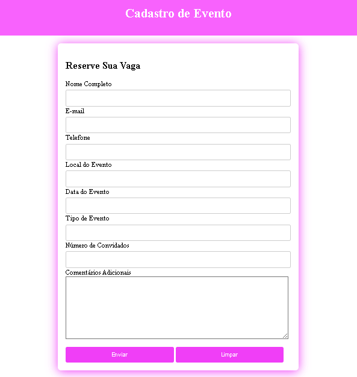

# Projeto - Cadastro de Evento
 
Projeto criado para um cadastro de evento
 
## Índice
* [Descrição](#descrição)
* [Tecnologias](#tecnologias)
* [Form.html](html)
* [style.css](css)
* [Resultado do Projeto](Resultado)
* [Referências](#referências)
* [Autor(a)](#autora)
 
## Descrição
 
Um projeto para criar uma página de cadastro para eventos como:
* Shows
* Espetáculos 
* Paléstra 
 
 
## Tecnologias
 
* HTML
* CSS3
* Git
* Github
 
 
## **HTML** _(form.html)_
 
< header >: Representa o cabeçalho de um documento ou seção. Pode incluir o título, logo, menu de navegação, entre outros elementos.
 
< h1 >: É um cabeçalho de nível 1, utilizado para o título mais importante de uma página ou seção. Apenas um < h1 > deve ser usado por página para melhorar a SEO.
 
< main >: Indica a parte principal do conteúdo de um documento. Deve conter o conteúdo central, excluindo cabeçalhos, rodapés e barras laterais.
 
< form >: Usado para criar um formulário, que pode ser utilizado para coletar dados do usuário. Pode incluir elementos como campos de texto, botões e menus suspensos.
 
< label >: Define um rótulo para um elemento de entrada (como < input >). Melhora a acessibilidade ao permitir que os usuários cliquem no rótulo para ativar o campo correspondente.
 
< input >: Usado para criar campos de entrada de dados. Pode ter diferentes tipos, como texto, senha, botão, entre outros, dependendo do atributo type.
 
< body>:  Representa o conteúdo de um documento HTML.
 
## **CSS** _(style.css)_
 
< margin>: Espaço externo ao redor de um elemento. Define a distância entre o elemento e outros elementos adjacentes.
 
< padding>: Espaço interno entre o conteúdo de um elemento e sua borda. Controla o espaço dentro do elemento.
 
< color >: Define a cor do texto de um elemento.
 
< display >: Controla como um elemento é exibido. Valores comuns incluem block, inline, flex, e grid.
 
< text-align >: Define o alinhamento do texto dentro de um elemento (por exemplo, left, right, center).
 
< border-radius >: Define o arredondamento dos cantos de um elemento.
 
< box-shadow >: Adiciona uma sombra ao redor de um elemento, permitindo que ele se destaque.

< box-sizing >: Utilizada para alterar a propriedade padrão da box model, usada para calcular larguras (widths) e alturas (heights) dos elementos.

< background >: É um atalho para definir os valores de fundo individuais em um único lugar na folha de estilo. 

< max-width >: Estabelece a largura máxima de um elemento.

< width >: Determina a largura da área de conteúdo de um elemento.

< margin-top >: Elemento indica o espaço acima do elemento.

< border >:  Pode ser utilizada para gerar o valor.

< cursor >: Especifica o cursor do mouse mostrado quando o ponteiro do mouse está sobre um elemento.

## Resultado do Projeto
 

 
## Referências
 
* [Alura](https://www.alura.com.br/artigos/escrever-bom-readme) - Como escrever um README incrivel no seu gitHub.
* [MDN](https://developer.mozilla.org/pt-BR/) - Usado para uma pesquisa aprofundada dos itens de CSS e HTML.
* [AleloWiki](https://alelowiki.cenargen.embrapa.br/index.php/P%C3%A1gina_principal) - Site usado na pesquisa dos códigos CSS.
* [Maujor](https://maujor.com/) - Site usado na pesquisa dos códigos CSS.
 
## Autor(a)
 
Projeto desenvolvido pelo aluno:
 
* Kiara Messias